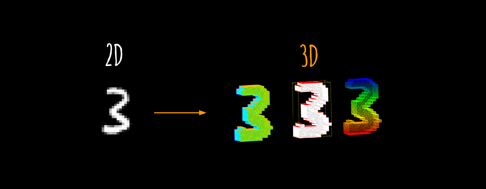

# 3DMNIST

A 3D version of the [MNIST database of handwritten digits](http://yann.lecun.com/exdb/mnist/)

You can also find and download the [dataset at Kaggle](https://www.kaggle.com/daavoo/3d-mnist)



The aim of this dataset is to provide a simple way to get started with 3D computer vision problems.

However there is a lack of large 3D datasets (you can find a [good one here](http://shapenet.cs.stanford.edu/) based on triangular meshes); it's especially hard  to find datasets based on point clouds (wich is the raw output from every 3D sensing device).

This dataset contains 3D point clouds generated from the original images of the MNIST dataset to bring a familiar introduction to 3D to people used to work with 2D datasets (images).

# Content

Full dataset containing train (4000 point clouds), test (1000) and valid (1000) folders compressed.

The dataset is in the format ready to be used by `dataset_to_feature_vector.py`.

```
data.zip/
    train/
        0/
            0.npy
            1.npy
            ...
        ...

        9/
            0.npy
            ...
    test/
        0/
            0.npy
            1.npy
            ...
        ...

        9/
            0.npy
            ...
    valid/
        0/
            0.npy
            1.npy
            ...
        ...

        9/
            0.npy
            ...
```

# Acknowledgements

- Website of the [original MNIST dataset](http://yann.lecun.com/exdb/mnist/)

